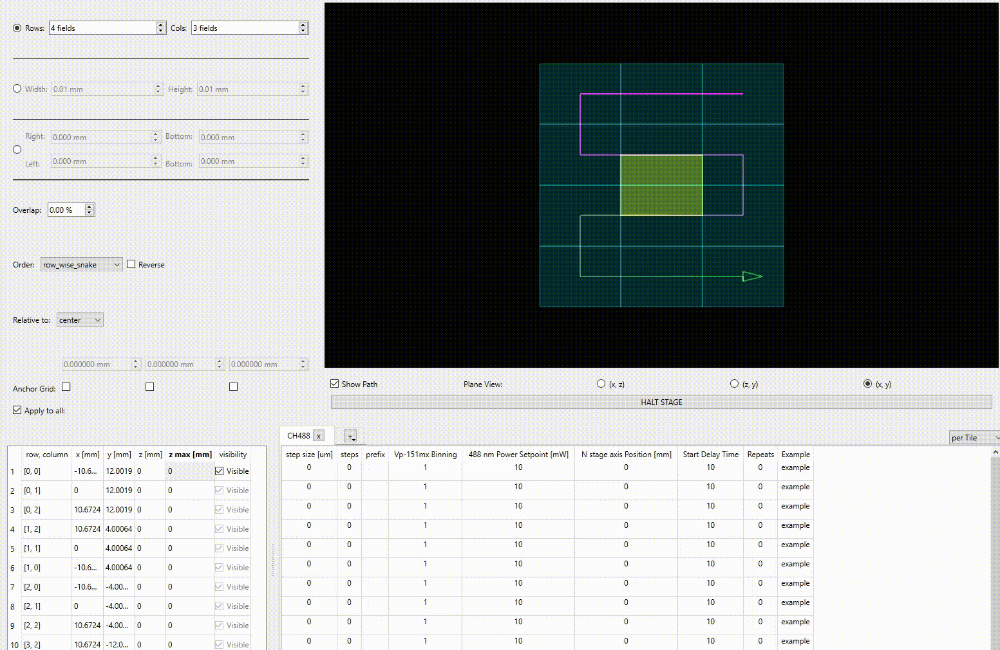
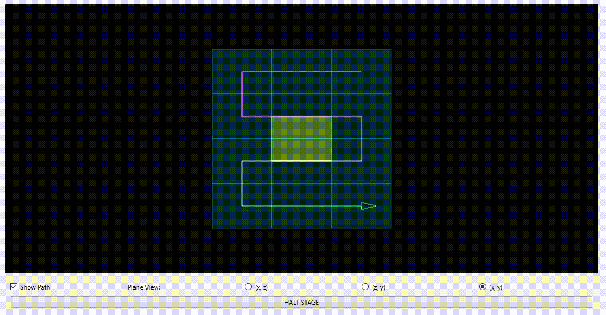
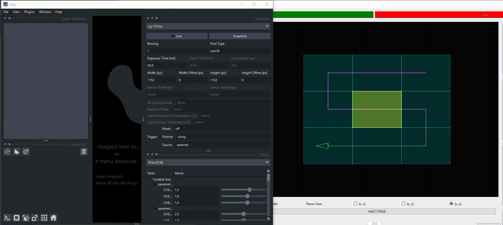
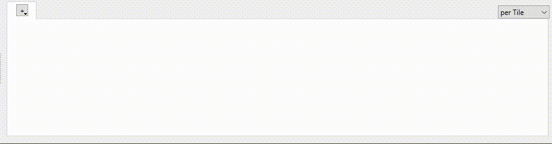
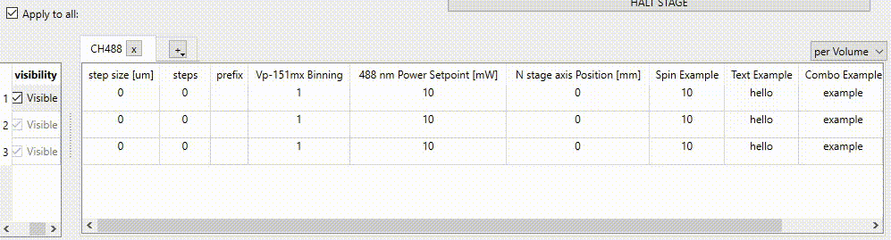

# View

## About
___
This project provides a graphical user interface (GUI) designed to interact with various lightsheet instruments and define 
tiles for the acquisition processes. View was developed to work with [Voxel](https://github.com/AllenNeuralDynamics/voxel) but can work 
with other instrument and acquisition engines that follow similar structures and naming conventions. 

As view was written to be compatible with as many different types of scopes as possible, the design is modular. 
View is composed of two main windows: instrument and acquisition. The Instrument window contains all the widgets for 
devices found in the input instrument (lasers, cameras, DAQs, stages, ect.). Widgets for each device can be specified in 
the config.yaml or use the default BaseDeviceWidget if not specified. The Acquisition window contains widgets for all operations 
found in the input acquisition (data writers, data transfers, routines, ect.). Similarly to the instrument window, 
widgets used for each operation can be specified in the config.yaml or use the default BaseDeviceWidget if not specified. The 
Acquisition window additionally houses widgets to define the scan volume for the acquisition engine. 

## Getting Started
___
### Prerequisites
Packages needed to use view should be contained in the pyproject.toml
- qtpy: core of gui components
- pyqtgraph: used mainly for opengl components for visualizing acquisition volume
- numpy
- napari: display images from camera
- pymmcore-widgets: basis for widgets planning acquisition volume
- pint: package to deal with units and unit conversion
- schema: validate values being set in gui
### Installation
1. Clone repo
```commandline
$ git clone git@github.com:AllenNeuralDynamics/view.git
```
2. Configure environment
```commandline
(view_env) C:\view> pip install -e . 
```
## Usage 
___

### Instrument View
#### Initialization
To initialize the instrument view, an instrument object needs to be created and passed in as an argument. The path to 
the yaml file that will be used to construct the UI will also need to be passed in as well as an optional logging level.
```
import sys
from qtpy.QtWidgets import QApplication

app = QApplication(sys.argv)

instrument = InstrumentObject()
instrument_view = InstrumentView(instrument, gui_yaml_path, logging_level)

sys.exit(app.exec_())
```
The instrument view will create widgets for each device found in the instrument object and group them together based on function. 
For lasers and stages, widgets will be stacked vertically. For cameras, filter wheels, joysticks, and DAQs widgets will 
be stacked ontop of each other and user can use the designated combobox to select which device is currently displayed. 
If the instrument object has devices that don't fit into these categories, these widgets will be separate pop up windows. 


#### yaml specifications
To specify a widget for a device, it must be included in the instrument_view dictionary under device_widget within the gui yaml.
The instrument_view portion of the yaml should be configured like so: 
```commandline
instrument_view:
  device_widgets:
      n stage axis:
        type: focusing_stage
        driver: view.widgets.device_widgets.stage_widget
        module: StageWidget
        init:
          advanced_user: False
        updating_properties:
          - position_mm
      488nm:
        type: laser
        driver: view.widgets.device_widgets.laser_widget
        module: LaserWidget
        init:
          color: blue
          advanced_user: False
```
Note that the name used in the gui yaml must match the name found in the instrument object and any init arguments should 
be included under init. If the device is not found within the yaml, the default will be a widget that will create text 
inputs for all properties of the device: 


View includes many types of device widget under view/widgets/device_widgets. The instrument view is assuming that device 
widgets will have certain properties outlined in voxel's base drivers so if using widgets outside the view repo, this is 
something to keep in mind. 

If there is a property of a device that needs to be updated during gui use, like position coordinates, the property 
needs to be included in the updating_properties list within the device section. 

### Acquisition View
#### Initialization
To initialize the acquisition view, an acquisition object needs to be created and passed in as an argument as well as
the instrument view. The acquisition view will share the same gui as the instrument view.
```
import sys
from qtpy.QtWidgets import QApplication

app = QApplication(sys.argv)

instrument = InstrumentObject()
instrument_view = InstrumentView(instrument, gui_yaml_path, logging_level)

acquisition = Acquisition(instrument, ACQUISITION_YAML)
acquisition_view = AcquisitionView(acquisition, instrument_view)

sys.exit(app.exec_())
```

The acquisition view will create widgets for each operation found in the acquisition object and group them together 
based on function, similar to the instrument view and devices. The acquisition view also contains widgets to help 
construct the acquisition volume: volume plan widget, volume model widget, and channel plan widget. 


#### yaml specifications
Under the acquisition_view portion of the yaml, the field of view dimensions (fov_view), coordinate_plane, and unit 
must be defined. The unit will be used consistently throughout the volume plan, volume model, and  channel plan to 
define the volume. Note that the fov_view must be in the same units as the unit variable. The coordinate plane will be a 
list defining [tiling dimension 0, tiling dimension 1, scanning dimension]. To specify a widget for an 
operation, it must be included in the acquisition_view dictionary under operation_widgets. Init arguments for
the volume plan, volume model, or channel plan can be specified in the acquisition_widgets under the corresponding 
widget name. The acquisition_view portion of the yaml should be configured something like so: 
```commandline
acquisition_view:
  operation_widgets:
    vp-151mx:
      imaris:
        type: writer
        updating_properties:
          - progress
      robocopy:
        type: transfer
        updating_properties:
          - progress
  fov_dimensions: [ 10.615616, 7.95872, 0 ]
  coordinate_plane: [ '-x', 'y', 'z' ]
  unit: 'mm'
  acquisition_widgets:
    channel_plan:
      init:
        properties:
          cameras: [ binning ]
          lasers: [ power_setpoint_mw ]
          focusing_stages: [ position_mm ]
          start_delay_time:
            delegate: spin
            type: float
            minimum: 0
            initial_value: 10
          repeats:
            delegate: spin
            type: int
            minimum: 0
```
Note that the operation name used in the gui yaml must match the name found in the aquisition object and any init 
arguments should be included under init. If the operation is not found within the yaml, the default will be a widget 
that will create text inputs for all properties of the operation. 

If there is a property of an operation that needs to be updated during an acquisition, like writer progress, the property 
needs to be included in the updating_properties list within the operation section. 

#### Volume Plan
The volume plan contains different modes to define the tiling dimension of the acquisitions as well as widgets to define
tile overlap, tile order, and tile relativism. The anchoring widgets will define the position where the volume will
start from in the corresponding dimensions. They are displayed in the order of whatever coordinate_plane was defined in 
the yaml. Checking the anchoring button will lock the start position of that dimension and users can manually change 
values. Unchecking the anchoring button will have the start be set at the current stage position. 


The volume plan also contains a table that displays an ordered list of configured tiles. The scanning dimension start 
and end value can be configured in this table. Note that if the scanning dimension anchor widget is not checked, then 
the scanning dimension start cannot be edited in the table. If the Apply to all button is checked, all tile volumes will
be based on the 0,0 tile volume. The rest of the table will be disabled. If Apply to all button is unchecked, tiles can 
be configured individually. 



The start and end tile can also be configured in the volume plan tile grid by right-clicking the vertical header bar of 
the graph. 


#### Volume Model
The volume model is a opengl widget that represents the acquisition volume. It can toggle between three planes to view 
the volume: (tiling dimension 0, tiling dimension 1), (tiling dimension 0, scanning dimension), and (scanning dimension, 
tiling dimension 1). There are 3 radio buttons to toggle between views. If a user clicks on the volume model, a popup 
will appear asking if the stage should be moved to the clicked position. The popup will contain a checkmark denoting if
the stage should move to the closest tile position to the clicked position. The halt button will stop stage movement. 



Taking a snapshot in the instrument view will result in the image being placed at the volume model. The napari contrast
sliders can be used to adjust contrast. To remove image, right click on the image in the volume model. 



#### Channel Plan
The channel plan is a table that allows the step size, step count, and tile prefix to be configured as well as specified 
device properties. To add a channel, click on the plus tab and select a channel. The acquisition will iterate through 
channels in the order of the tabs in the channel plan. To move a channel to a different index, click and drag the 
corresponding tab. To remove a channel, hit the x button on the tab. At the far right of the channel plan is a combo box 
to specify whether the acquisition will iterate through the channels per tile or per volume.  Like the volume plan, all 
channel values will be based on the 0,0 tile volume if the Apply to all button is checked and the rest of the table 
disabled. If Apply to all button is unchecked, tiles can be configured individually. 



To add device properties to the channel plan table, the properties must be included in the channel_plan init section of 
the yaml. The properties argument should be a dictionary with the keys being the device type and values, a list of 
property names to be editable for the corresponding device type. Note that the channel plan will use devices specified in 
the channels of the instrument to pick what device to set properties of. 

Non-device related columns can also be specified in the properties dictionary by creating an item pair where the key is 
the column title and the value a dictionary describing the column. All column dictionaries should contain
the delegate to use (combo, text, or spin), variable type, and initial value. Spin delegates should be used for numbers 
and combo delegates should be used for variable restricted to specific values. Spin column dictionaries can also define 
minimum or maximum values. Combo column dictionaries must include a list of items to select from. An example of how to 
configure the gui yaml is seen below:

```
acquisition_view:
  acquisition_widgets:
    channel_plan:
      init:
        properties:
          cameras: [ binning ]
          lasers: [ power_setpoint_mw ]
          focusing_stages: [ position_mm ]
          spin_example:
            delegate: spin
            type: float
            minimum: 0
            maximum: 100
            initial_value: 10
          text_example:
            delegate: text
            type: str
            initial_value: hello
          combo_example:
            delegate: combo
            type: str
            items: [ 'this', 'is', 'an', 'example' ]
            initial_value: example
```

